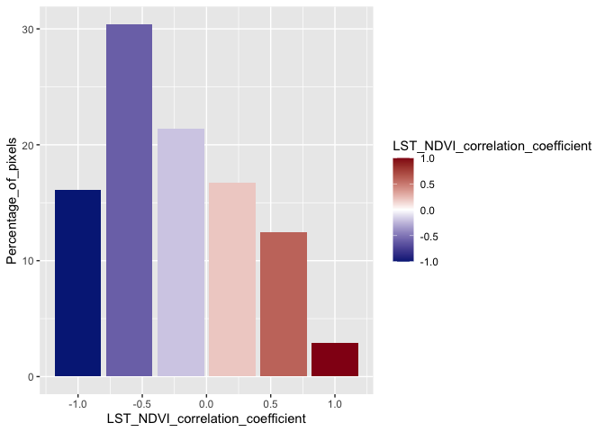
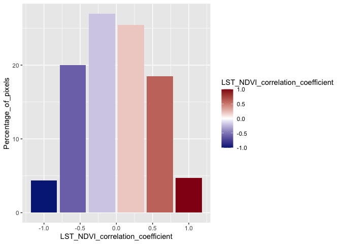
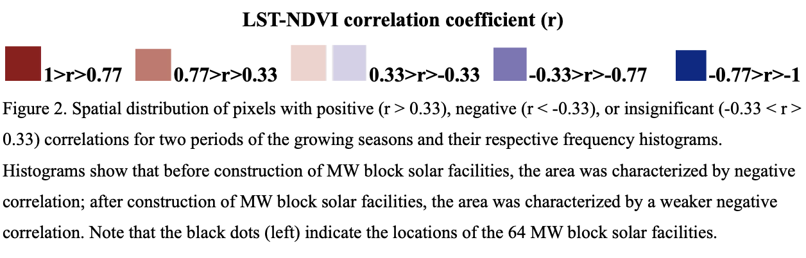

LST-NDVI correlation coefficient NYSERDA MW Blocks
================

## Gather Pixel Frequency from Excel

``` r
ee_chart_Pre_Construction <- read_excel("~/GitHub/NYSERDA-MW-Block/results/ee-chart_Pre-Construction.xlsx")
View(ee_chart_Pre_Construction)
# 2010-14 Pre-Construction LST-NDVI Correlation Coefficient pixel frequency of
# NYSERDA MW Block Solar Farms, 
# Data Source: MODIS Satellite & NYSERDA, 
# Processed in Google Earth Engine,
# Data pixel frequency in Excel (in 'results' subdirectory)
```

``` r
ee_chart_Post_Construction <- read_excel("~/GitHub/NYSERDA-MW-Block/results/ee-chart_Post-Construction.xlsx")
View(ee_chart_Post_Construction)
# 2018-22 Post-Construction LST-NDVI Correlation Coefficient pixel frequency of
# NYSERDA MW Block Solar Farms, 
# Data Source: MODIS Satellite & NYSERDA, 
# Processed in Google Earth Engine,
# Data pixel frequency in Excel (in 'results' subdirectory)
```

## Load ggplot for creating graphs

``` r
library(ggplot2)
# load R package for creating graphs
```

## Plots

#### Pre-Construction Pixel Frequency

``` r
ggplot(ee_chart_Pre_Construction, aes(x=LST_NDVI_correlation_coefficient,y=Percentage_of_pixels)) + 
  geom_bar(aes(fill = LST_NDVI_correlation_coefficient), stat = "identity") +
  scale_fill_gradient2(low = '#062686', mid = '#FFFFFF', high = '#931118', midpoint = 0)
```

    ## Warning: Removed 1 rows containing missing values (`position_stack()`).

<!-- -->

``` r
# Histogram of Pre-Construction LST-NDVI Correlation Coefficient pixel frequency
```

#### Post-Construction Pixel Frequency

``` r
ggplot(ee_chart_Post_Construction, aes(x=LST_NDVI_correlation_coefficient,y=Percentage_of_pixels)) + 
  geom_bar(aes(fill = LST_NDVI_correlation_coefficient), stat = "identity") +
  scale_fill_gradient2(low = '#062686', mid = '#FFFFFF', high = '#931118', midpoint = 0)
```

    ## Warning: Removed 1 rows containing missing values (`position_stack()`).

<!-- -->

``` r
# Histogram of Post-Construction LST-NDVI Correlation Coefficient pixel frequency
```

<div class="figure">


<p class="caption">
Pixel Frequency Legend and Description
</p>

</div>
